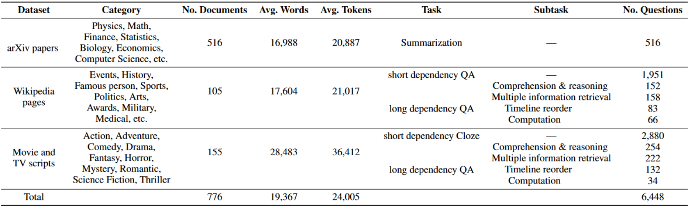
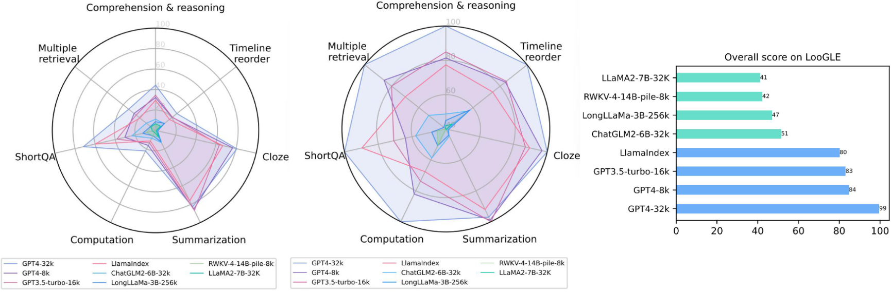

<div align="center" id="title">  </div>

<h2 align="center">Long Context Generic Language Evaluation benchmark for LLM long context understanding</h2>
<p align="center">
    <a href="https://opensource.org/licenses/MIT">
        
    </a>
    <a href="https://huggingface.co/datasets/bigainlco/LooGLE">
        
    </a>
    <a href="https://bigai-nlco.github.io/LooGLE/">
        
    </a>
    <a href="https://arxiv.org/abs/2311.04939">
        
    </a>
</p>


**LooGLE** is a comprehensive evaluation benchmark for LLM long context understanding which contains up-to-date  (all after 2022) and extremely long realistic documents (over 24k tokens per document, many of which exceed 100k words) and 6,000 newly generated questions spanning diverse domains and categories. Details statistics of our dataset can be seen in the table below.

**Short and long dependency tasks  📜**  LooGLE is composed of 7 major tasks to evaluate LLMs' ability to understand both short and long dependency content. We refer to ``long dependency" tasks as those that require the understanding of the inter-dependency across multiple shreds of evidence widely spanning over the entire long text. We delicately design 5 types of long dependency tasks, including comprehension and reasoning, computation, timeline reorder, multiple information retrieval, and summarization.

**Long context evaluation  📊**  In order to provide more comprehensive and general results, LooGLE relies on automatic metrics based on semantic similarity, GPT4-as-judgment and human evaluation to get an overall performance for reference. We conducted the evaluation of 8 representative LLMs. We specifically select LLMs which have made great effort in addressing the challenge of understanding long contexts by utilizing flash attention, position interpolation, optimized Transformer and finetuning, external memory etc. 

LooGLE not only provides a systematic and comprehensive evaluation schema on long-context LLMs, but also sheds light on the future development of enhanced models toward “true long-context understanding”.


## 📌 **Statistics of LooGLE**



## ✏️ **Table of Contents**
- [📌 **Statistics of LooGLE**](#-statistics-of-loogle)
- [✏️ **Table of Contents**](#️-table-of-contents)
- [🚀 **Capability leaderboard**](#-capability-leaderboard)
- [💁 **Quick Start**](#-quick-start)
  - [**Step 1. Prerequisites**](#step-1-prerequisites)
  - [**Step 2. Download the data**](#step-2-download-the-data)
  - [**Step 3. Generate the prediction results**](#step-3-generate-the-prediction-results)
  - [**Prediction for retrieval based methods**](#prediction-for-retrieval-based-methods)
- [📊 **Evaluation**](#-evaluation)
  - [**Evaluation on Timeline reorder task**](#evaluation-on-timeline-reorder-task)
- [📝 **Citation**](#-citation)
- [📣 **Contacts**](#-contacts)


## 🚀 **Capability leaderboard**
The overall performance comparisons of different models on different tasks in our dataset are shown in the figure below.



<br>

## 💁 **Quick Start**
### **Step 1. Prerequisites**
Clone this repo and install the dependencies. The test environment is under torch 2.0.1+cu121.

```bash
cd LooGLE   
conda create -n loogle python=3.9
conda activate loogle
pip install -r requirements.txt
export OPENAI_API_KEY="[your_openai_api_key]"
```


### **Step 2. Download the data** 
You can download and load the **LooGLE** data through the Hugging Face datasets ([🤗 HF Repo](https://huggingface.co/datasets/bigainlco/LooGLE)):

```python
from datasets import load_dataset

datasets = ["shortdep_qa", "shortdep_cloze", "longdep_qa", "longdep_summarization"]

for testset in datasets:
    data = load_dataset('bigainlco/LooGLE', testset, split='test')
    # evaluate your model
```
You can also access our sample data [LooGLE-testdata/](LooGLE-testdata/).

All data in **LooGLE** are standardized to the following format:
```json
{
    "input": "The original long input texts",
    "title": "The title of the given document",  //for arxiv paper, we use "title" to refer the identical ID for specific paper
    "qa_pairs":[
            {
                "Q": "Question to ask based on the given input",
                "A": "Groundtruth answer for the question",
                "S": [ "One or more evidence (complete sentences) for answering the question, which are extracted directly from the original input"
                ]
            },  
        ]        // There are multiple questions and corresponding answers in the list (each of them is in json format)
                 // For arxiv paper summarization, we use "none" instead for non-qa/non-cloze tasks
    "output": "none"   // the predicted outputs of LLM given the long input and instructions, which is initialized as "none"
```
To mention that, in long dependency QA data, we add an extra key `type` for each question in json to indicate the 4 types of long dependency tasks(apart from summarization).

<br>

### **Step 3. Generate the prediction results**
We test LLMs using 3 Python codes under the path [Prediction/](Prediction/) for corresponding types of models. We select the model for evaluation via `--model_name` and the specific task via `--task`. Let's take short dependency QA as an example:

For GPT-3.5-turbo and GPT4:
```
python Prediction/pred_gpt_models.py  --model_name gpt-3.5-turbo-16k --task shortdep_qa --max_length 500
```

For LlamaIndex:
```
python Prediction/pred_llamaindex.py --task shortdep_qa --max_length 500
```

For other open-source models (take chatglm2-6b-32k as an example):
```
python Prediction/pred_opensource_models.py  --model_name chatglm2-6b-32k --task shortdep_qa --max_length 500
```

Open-source models can be downloaded and loaded from [Models/](Models/) by default, you can change the path via `--model_path`

You can also determine the long text output result through `--output_path`.  

Please note that in `config/`, we provide the prompt format suitable for each task and the maximum generation length. The input parameter `--max_length` limits the max length of the input prompt for selected model. Feel free to modify them to better suit the model you want to evaluate. 

We test all the open-source baselines with a single 80G A800 GPU in BF16 precision. For Llama-2 based models, we recommend using [Flash Attention](https://github.com/Dao-AILab/flash-attention) for optimization and saving GPU memory.

### **Prediction for retrieval-based methods**

To evaluate the effectiveness of retrieval techniques for long-context dependency questions, we undertook extensive experiments by replacing the base LLM model in LlamaIndex with different baseline LLMs. 

For retrieval-based methods (take chatglm2-6b-32k as an example):
```
python Retrieval/pred_retrieval_based_method.py --model_name chatglm2-6b-32k --task shortdep_qa --max_length 500 --emb_model_name sentence-transformers/all-mpnet-base-v2
```
Use `--emb_model_name` to set embedding models for retrieval-based methods. Here we used all-mpnet-base-v2 as default.

## 📊 **Evaluation**

Given the prediction file generated in Step 2, we run the evaluation code in [Evaluation/](Evaluation/).

For automatic evaluation in short and long-dependency QA, summarization task  (eg. short-dependency QA):

```
python Evaluation/automatic_eval.py --model_name chatglm2-6b-32k --task shortdep_qa --eval_metric automatic_sim
```

For automatic evaluation in cloze task:

```
python Evaluation/automatic_eval.py --model_name chatglm2-6b-32k --task shortdshortdep_cloze --eval_metric automatic_match
```

For  LLM-as-judge in short and long dependency QA, summarization task (eg. short dependency QA):

```
python Evaluation/llm_eval.py --model_name chatglm2-6b-32k --task shortdep_qa
```

Besides the parameters specifying the `--model_name` and `--task`, we provide `--eval_metric` for users to choose the method for automic evaluation from [`automatic_sim`, `automatic_match`]. 

Automatic metrics based on semantic similarity matching including Bleu, Rouge, Meteor, Bertscore and exact/partial match are supported. Feel free to add other metrics for your needs in  [Evaluation/automatic_metrics.py](Evaluation/automatic_metrics.py). Besides, the prompt of GPT4 given in the repo can be altered for further evaluation.

### **Evaluation on Timeline reorder task**
 We provide four metrics: LSD (location square deviation), LMD (location mean deviation), SD
(swap deviation), and SDD (swap distance deviation) to measure the similarity of numeric sequences for time reorder tasks with regularized outputs. Details of the implementations can be seen in our paper.

For LLM in long dependency timeline reorder task:
```
python Reorder/automatic_eval.py --model_name chatglm2-6b-32k
```

<!-- ## 📝 **Tools**
Here is an example for our annotation websit for long dependency QA task.
<br> -->

## 📝 **Citation**
If you would like to use our data or find our work interesting, please cite:
```bibtex
@misc{li2023loogle,
  title={Can Long-Context Language Models Understand Long Contexts?},
  author={ Li, Jiaqi and Wang, Mengmeng and Zheng, Zilong and Zhang, Muhan },
  url={https://github.com/bigai-nlco/LooGLE},
  year={2023}
}
```

## 📣 **Contacts**

We sincerely appreciate human annotators for their valuable contributions on creating high-quality long-dependency QA tasks.
We are very pleased to answer any questions about LooGLE: [nlp@bigai.ai](mailto:nlp@bigai.ai)
